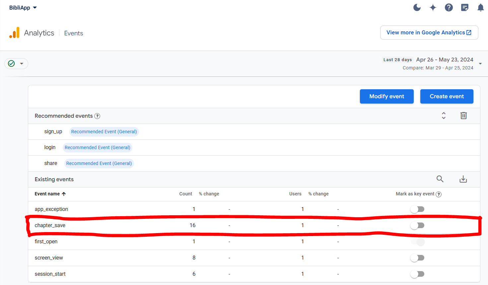
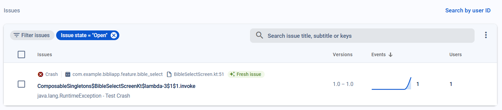
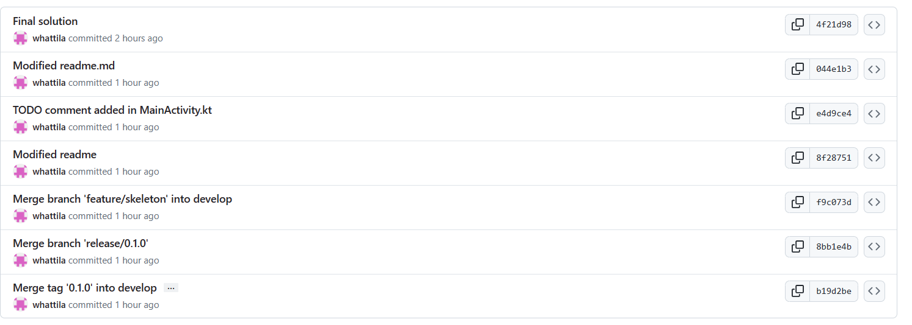
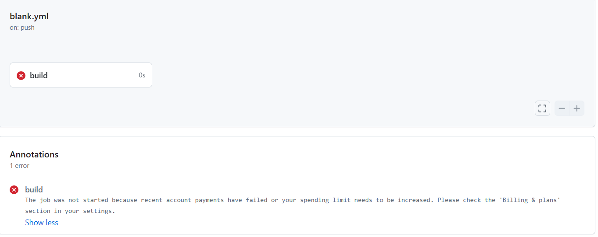

# Tesztek és analitika
Screenshot az eseményekről a kontrol panelen. A chapter_save eseményt én definiáltam: 

Screenshot az összeomlásokról a kontrol panelen: 

# Felület és üzleti logika
A bemutató videó linkje: https://www.youtube.com/watch?v=cSIID6YKK4o
# Hálózati réteg és adatbázis
## Hálózati réteg osztályai
### BibleApiClient:
Létrehoz egy implementált példányt a BibleApiService interfészből a RetrofitClient segítségével
### RetrofitClient:
Tárolja a backend alap URL-jét, és legenerálja a BibleApiService interfész implementációját
### BibleApiService:
Ebben az interfészben találhatóak az API hívások deklarációi
### models mappa osztályai:
A backendtől JSON-ként kapott adatokat képzik le Kotlin data classokra
### NetworkModule:
A fenti osztályokat injektálja az azokat használó osztályokba
## Adatbázis réteg osztályai
### Chapter:
Definiálja a chapter adatbázis-táblát, és hogy milyen adatokat tárolunk a lementett fejezetekről
### ChapterHeader:
Tartalmazza a mentett fejezetekről az azokat listázó nézeten megjelenített adatokat
### ChapterDAO:
A chapter tábla fölötti DAO osztály
### AppDatabase:
Az adatbázist reprezentáló osztály, rajta keresztül érhető el a ChapterDAO is
### DatabaseModule:
A fenti osztályokat injektálja az azokat használó osztályokba

# Architektúra

Az alkalmazás architektúrája az MVVM mintát követi, mivel ez manapság az általános az adatvezérelt alkalmazásoknál. 
A View-k és ViewModelek feature-ök szerint vannak csoportosítva. 
A több réteg által használt data classok a domain mappában találhatók. 
A data/repositories mappában találhatók a repositoryk, mivel ezeket több nézet is használja (a data mappában lesznek még az adatbázissal és hálózaton kommunikáló osztályok, database és network mappákban). 

# Házi feladat specifikáció

Információk [itt](https://viaumb02.github.io/laborok/android/A01/)

## Mobilszoftver Laboratórium
### 2024.03.23.
### Hidán Attila Szabolcs - (nwvrra)
### Laborvezető: Hideg Attila

## BibliApp

## Bemutatás

Az alkalmazás egyetlen helyen összegyűjti a Biblia számtalan különböző (nyelvű) változatát. Segítségével bárhol olvashatjuk az Ó- és az Újszövetséget, a kedvenc részeinket internetkapcsolat nélkül is.

## Főbb funkciók

Az alkalmazással a Biblia böngészésére van lehetőségünk az American Bible Society (ABS) API-ja, az API.Bible (https://docs.api.bible/) segítségével. 
A nyitóoldalon egy listából választhatunk az API.Bible elérhető fordításai közül. Ezután két újabb listázó oldalon kiválasztjuk az adott fordításnak azt a könyvét és a könyv fejezetét, amit olvasni szeretnénk. Egy részletező oldalon pedig olvashatjuk a választott fejezetet. 
Lehetőségünk van a kedvenc fejezeteinknek a lementésére egy lokális adatbázisba, melyeket így offline is olvashatunk. Ezt az olvasó nézeten tehetjük meg. A lementett fejezeteket egy külön listában láthatjuk, ahol megnyithatjuk és olvashatjuk őket, illetve kivehetjük őket a mentettek közül. Legfeljebb 5 fejezetet menthetünk le egyszerre, utána az újonnan mentett fejezetek felülírják a legrégebben mentetteket. 

### User story-k:

Én mint Aladár, el akarom olvasni János evangéliumát, hogy felkészüljek lélekben karácsonyra. 
Én mint Béla, le akarom menteni az Apostolok cselekedeteit, hogy olvashassam őket a repülőn is.

### Use case-ek:

<b>Cím</b>: Fejezet olvasása. 
<b>Leírás</b>: Kiválasztjuk az adott fordítás egy elérhető fejezetét és olvassuk azt. 
<b>Aktorok</b>: Felhasználó 
<b>Főforgatókönyv</b>: 1. A felhasználó a változatlistázó képernyőn kiválasztja a megfelelő változatot. 2. A felhasználó a könyvlistázó képernyőn kiválasztja a megfelelő könyvet. 3. A felhasználó a fejezetlistázó képernyőn kiválasztja a megfelelő fejezetet. 4. A felhasználó a fejezetolvasó nézeten olvassa a választott fejezetet. 
<b>Alternatív forgatókönyv</b>: Az 1-4. lépések során valahol hiba miatt nem töltődik be a tartalom.

<b>Cím</b>: Fejezet mentése. 
<b>Leírás</b>: Kiválasztjuk az adott fordítás egy elérhető fejezetét és elmentjük azt az offline adatbázisba. 
<b>Aktorok</b>: Felhasználó 
<b>Főforgatókönyv</b>: 1. A felhasználó a változatlistázó képernyőn kiválasztja a megfelelő változatot. 2. A felhasználó a könyvlistázó képernyőn kiválasztja a megfelelő könyvet. 3. A felhasználó a fejezetlistázó képernyőn kiválasztja a megfelelő fejezetet. 4. A felhasználó a fejezetolvasó nézeten megnyomja a mentés gombot. 
<b>Alternatív forgatókönyv</b>: Az 1-4. lépések során valahol hiba miatt nem töltődik be a tartalom.

<b>Cím</b>: Mentett fejezet olvasása. 
<b>Leírás</b>: Kiválasztjuk az egyik korábban mentett fejezetet és olvassuk azt. 
<b>Aktorok</b>: Felhasználó 
<b>Főforgatókönyv</b>: 1. A felhasználó a mentett fejezetek képernyőn kiválasztja az egyik fejezetet. 2. A felhasználó a fejezetolvasó nézeten olvassa a választott fejezetet.

<b>Cím</b>: Fejezet kivétele a mentettek közül. 
<b>Leírás</b>: Az egyik korábban mentett fejezetet kivesszük a mentettek közül. 
<b>Aktorok</b>: Felhasználó 
<b>Főforgatókönyv</b>: 1. A felhasználó a mentett fejezetek képernyőn kiválasztja az egyik fejezetet törlésre.

### Use case diagram

## Képernyőtervek

