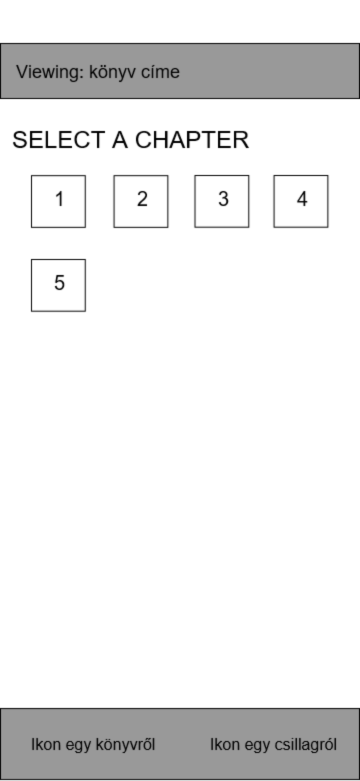

# Házi feladat specifikáció

Információk [itt](https://viaumb02.github.io/laborok/android/A01/)

## Mobilszoftver Laboratórium
### 2024.03.23.
### Hidán Attila Szabolcs - (nwvrra)
### Laborvezető: Hideg Attila

## BibliApp

## Bemutatás

Az alkalmazás egyetlen helyen összegyűjti a Biblia számtalan különböző (nyelvű) változatát. Segítségével bárhol olvashatjuk az Ó- és az Újszövetséget, a kedvenc részeinket internetkapcsolat nélkül is.

## Főbb funkciók

Az alkalmazással a Biblia böngészésére van lehetőségünk az American Bible Society (ABS) API-ja, az API.Bible (https://docs.api.bible/) segítségével. 
A nyitóoldalon egy listából választhatunk az API.Bible elérhető fordításai közül. Ezután két újabb listázó oldalon kiválasztjuk az adott fordításnak azt a könyvét és a könyv fejezetét, amit olvasni szeretnénk. Egy részletező oldalon pedig olvashatjuk a választott fejezetet.
Lehetőségünk van a kedvenc fejezeteinknek a lementésére egy lokális adatbázisba, melyeket így offline is olvashatunk. Ezt az olvasó nézeten tehetjük meg. A lementett fejezeteket egy külön listában láthatjuk, ahol megnyithatjuk és olvashatjuk őket, illetve kivehetjük őket a mentettek közül. Legfeljebb 5 fejezetet menthetünk le egyszerre, utána az újonnan mentett fejezetek felülírják a legrégebben mentetteket. 

### User story-k:

Én mint Aladár, el akarom olvasni János evangéliumát, hogy felkészüljek lélekben karácsonyra.
Én mint Béla, le akarom menteni az Apostolok cselekedeteit, hogy olvashassam őket a repülőn is.

### Use case-ek:

Cím: Fejezet olvasása.
Leírás: Kiválasztjuk az adott fordítás egy elérhető fejezetét és olvassuk azt.
Aktorok: Felhasználó
Főforgatókönyv: 1. A felhasználó a változatlistázó képernyőn kiválasztja a megfelelő változatot. 2. A felhasználó a könyvlistázó képernyőn kiválasztja a megfelelő könyvet. 3. A felhasználó a fejezetlistázó képernyőn kiválasztja a megfelelő fejezetet. 4. A felhasználó a fejezetolvasó nézeten olvassa a választott fejezetet.
Alternatív forgatókönyv: Az 1-4. lépések során valahol hiba miatt nem töltődik be a tartalom.

Cím: Fejezet mentése.
Leírás: Kiválasztjuk az adott fordítás egy elérhető fejezetét és elmentjük azt az offline adatbázisba.
Aktorok: Felhasználó
Főforgatókönyv: 1. A felhasználó a változatlistázó képernyőn kiválasztja a megfelelő változatot. 2. A felhasználó a könyvlistázó képernyőn kiválasztja a megfelelő könyvet. 3. A felhasználó a fejezetlistázó képernyőn kiválasztja a megfelelő fejezetet. 4. A felhasználó a fejezetolvasó nézeten megnyomja a mentés gombot.
Alternatív forgatókönyv: Az 1-4. lépések során valahol hiba miatt nem töltődik be a tartalom.

Cím: Mentett fejezet olvasása.
Leírás: Kiválasztjuk az egyik korábban mentett fejezetet és olvassuk azt.
Aktorok: Felhasználó
Főforgatókönyv: 1. A felhasználó a mentett fejezetek képernyőn kiválasztja az egyik fejezetet. 2. A felhasználó a fejezetolvasó nézeten olvassa a választott fejezetet.

Cím: Fejezet kivétele a mentettek közül.
Leírás: Az egyik korábban mentett fejezetet kivesszük a mentettek közül.
Aktorok: Felhasználó
Főforgatókönyv: 1. A felhasználó a mentett fejezetek képernyőn kiválasztja az egyik fejezetet törlésre.

### Use case diagram

## Képernyőtervek

